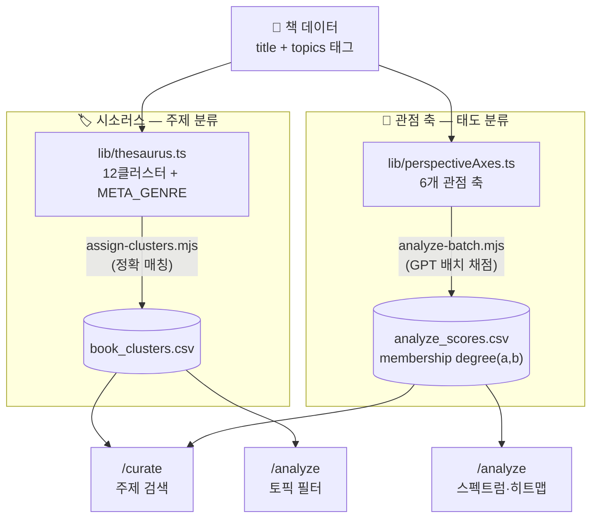

# ViewPoint — 관점 기반 북큐레이션 웹앱 + 연구 도구

> 같은 주제, 다른 시선으로 읽다

**ViewPoint**는 사용자가 주제를 입력하면 AI가 관련 도서를 관점 축에 따라 분류해서
보여주는 북큐레이션 웹앱입니다. 사서의 주제 분석 전문성과 AI의 분류 능력을 결합하여,
단순 추천을 넘어 **다각적 독서 경험**을 제안합니다.

동시에 이 프로젝트는 문헌정보학 + 디지털인문학(DH)을 공부하는 학생의 **실증 연구 도구**이기도
합니다. 큐레이션 앱(`/curate`)과 연구용 분석 도구(`/analyze`, **ViewPoint Labs 🧪**)가
같은 판단 데이터를 공유하는 하나의 시스템으로 설계되어 있습니다.

🔗 **배포 주소**: [viewpoint-curation.vercel.app](https://viewpoint-curation.vercel.app)

---

## 주요 기능

### 관점별 도서 큐레이션 (`/curate`)

주제를 입력하면(자유 텍스트 또는 시소러스 주제 칩) AI가 6가지 관점 축 중 하나를 기준으로
도서를 분류합니다 — 개인 차원 ↔ 구조 차원, 중립적 분석 ↔ 비판적 성찰, 현재 진단 ↔
미래 전망, 원인 분석 ↔ 방안 제시, 학술·전문 ↔ 대중·실용, 서사 중심 ↔ 설명 중심.

두 관점 중 어느 한쪽으로 확실히 기울지 않는 책은 **"두 관점이 교차하는 책"** 섹션에
별도로 모아 보여줍니다. 이분법으로 억지 배정하거나 조용히 숨기지 않고, 애매함 자체를
있는 그대로 드러내는 쪽을 택했습니다.

각 책 카드의 **"관점 스펙트럼 확인"** 버튼을 누르면 6개 축 전체에서 그 책이 어디쯤
위치하는지 볼 수 있고, 이 값은 `/analyze`에서 보는 값과 항상 동일합니다.

### ViewPoint Labs 🧪 (`/analyze`)

293권 전체를 대상으로 한 연구용 분석 인터페이스입니다.

- **스펙트럼 뷰**: 축 위에 책을 점으로 배치, 위치는 관점 소속도(membership degree)
- **히트맵 뷰**: 책×축 매트릭스, 큐레이션 출처(사서추천/일간지 서평)별 평균, CSV 다운로드
- **시소러스 토픽 필터**: 12개 주제 클러스터로 좁혀보기

### 예비 사서 큐레이션 데이터 기반

- 예비 사서가 직접 수집한 **신문 서평 데이터** 166권 (경향·한겨레·동아·조선일보)
- **국립중앙도서관 사서추천 도서** 127권
- 총 293권의 검증된 도서 DB
- 태그 표본 감사(30권, 층화 추출)를 통해 원천 태그 정밀도를 검증하고 오류를 정규화한
  이력 있음 (오태깅 삭제, 유의어 정규화, 장르 태그 보강 등)

### 내 서재

마음에 드는 책을 저장하고 관리할 수 있는 개인 서재 기능

---

## 기술 스택

| 분류     | 기술                                                |
| ------ | ------------------------------------------------- |
| 프레임워크  | Next.js 14 (App Router) + TypeScript              |
| 스타일링   | Tailwind CSS                                       |
| 데이터베이스 | Supabase (PostgreSQL)                              |
| AI     | GPT-4o-mini (OpenAI API)                           |
| 폰트     | Gowun Batang, Playfair Display, Plus Jakarta Sans  |
| 배포     | Vercel                                             |
| 개발 도구  | Claude Code (구조 리팩토링), Cursor (초기 바이브코딩)          |

---

## 시스템 구조 — 주제(WHAT)와 태도(HOW)의 분리

ViewPoint는 책을 두 개의 독립된 축으로 분류합니다. **시소러스**는 책이 *무엇에 대한
책인가*(주제)를 결정하고, **관점 축**은 그 주제를 *어떤 태도로 다루는가*(입장)를
결정합니다. 한 책이 "AI·기술·미래" 클러스터에 속하면서 동시에 "개인↔구조" 축에서는
구조 쪽에 가깝게 위치할 수 있는 것처럼, 두 분류는 서로 겹치지 않는 별개의 질문입니다.



두 앱은 이 두 CSV(시소러스 매핑, membership degree)를 **같은 파일로 공유**합니다.
`/curate`가 예전처럼 그때그때 GPT를 다시 불러 즉석 판단하는 방식이 아니라, 미리
계산된 값을 조회하기만 하므로 같은 책이 두 화면에서 다르게 분류되는 일이 구조적으로
발생하지 않습니다. GPT는 이미 정해진 배정에 대해 **근거를 설명하는 reason 문장
생성에만** 관여합니다.

```
사용자 주제 입력 (자유 텍스트 또는 시소러스 칩)
    ↓
Supabase에서 후보 도서 검색
    ↓
analyze_scores.csv에서 해당 도서들의 membership degree 조회
    ↓
margin 규칙으로 그룹 분류 (관점 A / 관점 B / 교차하는 책)
    ↓
GPT-4o-mini가 태그·서평 헤드라인을 근거로 reason 문장만 생성
    ↓
책 정보(표지, 저자, 연도)는 100% Supabase에서 조회
    ↓
결과 반환
```

> **환각 방지 설계**: AI는 도서 목록에서 제목을 선택하지 않고 이미 결정된 분류에
> 대한 이유만 작성합니다. 책 정보는 반드시 DB에서만 가져오도록 설계하여 존재하지
> 않는 책 추천을 원천 차단합니다.

---

## 데이터 설계

### Supabase 테이블 구조

```
books (293권)
  - notion 출처: 사서 직접 수집 신문 서평 도서 (166권)
  - nlk 출처: 국립중앙도서관 사서추천 도서 (127권)

sources (4개 언론사)
  - 경향신문, 한겨레신문, 동아일보, 조선일보

reviews (245건)
  - 서평 헤드라인 → reason 생성 근거로 활용
```

### 주제 태그 시스템

- 사서의 주제 분석 전문성을 바탕으로 AI가 자동 생성한 해시태그 기반 태그
- 예: `#자본주의비판`, `#소설`, `#디스토피아문학`
- `#소설` 태그 유무가 서사↔설명 축 채점의 유일한 장르 신호로 사용됨
- 태그 표본 감사를 통해 오태깅·은유혼동·형태 오류를 식별해 정규화 (진행 중,
  주기적으로 재검증)

### 관점 축 채점

- GPT-4o-mini, temperature 0으로 책마다 6축 membership degree(0~1, 독립값) 산출
- 해시 캐싱(title+topics)으로 293권 전체를 증분 배치 채점 — 태그가 바뀐 책만 재채점
- 연구 재현성을 위해 특정 시점 스냅샷을 별도 보존 (버전 관리)

---

## 프로젝트 배경

이 프로젝트는 **문헌정보학 + 디지털인문학**의 교차점에서 출발했습니다.

사서의 핵심 역량인 **주제 분석(Subject Analysis)** 을 AI와 결합하여, 단순한 도서
추천을 넘어 독자가 하나의 주제를 다양한 시선으로 탐색할 수 있는 경험을 설계했습니다.

큐레이션 앱을 만들다가, 관점을 두 컬럼으로 강제 배정하는 구조 자체가 KDC 같은
열거식 분류의 단일범주 강제 문제를 다른 형태로 반복하고 있다는 것을 발견했습니다.
이 자기성찰에서 **퍼지 논리(fuzzy logic)의 membership degree**를 도입해 "이 책은
이 관점에 속한다/안 속한다"가 아니라 "얼마나 속하는가"로 표현하는 현재 구조로
발전했고, 이것이 `/curate`와 `/analyze`(Labs)를 하나의 판단 엔진으로 통합하는
설계로 이어졌습니다.

---

## 개발 과정

- 바이브코딩(Vibe Coding) 방식으로 개발 시작 — Cursor + Claude + ChatGPT + Gemini 협업
- Ollama(로컬 LLM) → OpenAI GPT-4o-mini로 전환
- 시소러스(통제어휘) 3라운드 개정, 태그 표본 감사를 통한 원천 데이터 품질 검증
- 관점 세트를 이분법적 대립쌍(긍정/부정 등)에서 사회과학·인문학적으로 의미 있는
  6개 축으로 재설계
- `/curate`와 `/analyze`(Labs)가 별도 로직으로 판단하며 발생한 분류 불일치를
  발견·진단하여 단일 판단 엔진(membership degree 조회 기반)으로 통합
- 개발 도구를 Cursor에서 Claude Code로 전환하며 멀티파일 구조 리팩토링을 안정적으로
  수행 (STEP 단위 진행, 매 STEP 커밋 원칙)

---

## 로컬 실행

```bash
# 저장소 클론
git clone https://github.com/pinakes-me/viewpoint.git
cd viewpoint

# 의존성 설치
npm install

# 환경변수 설정 (.env.local)
NEXT_PUBLIC_SUPABASE_URL=...
NEXT_PUBLIC_SUPABASE_ANON_KEY=...
OPENAI_API_KEY=...
NAVER_CLIENT_ID=...
NAVER_CLIENT_SECRET=...
NLK_API_KEY=...
SUPABASE_SERVICE_ROLE_KEY=...   # 데이터 정규화 스크립트(dry-run/apply)용, 쓰기 권한 필요 시만

# 개발 서버 실행
npm run dev
```

### 데이터 파이프라인 스크립트

```bash
# 293권 관점 축 배치 채점 (해시 캐싱, 증분 처리)
node scripts/analyze-batch.mjs

# 시소러스 기준 클러스터 매핑
node scripts/assign-clusters.mjs
```

---

## 만든이

**사적인북마크**
사서를 희망하는 사람. 디지털인문학과 문헌정보학의 교차점에서, 도서관 안팎의 비정형 데이터를 발굴하고 새로운 가치로 변환하는 데 관심이 많습니다.

🐦 Twitter [@pinakes_me](https://twitter.com/pinakes_me)
